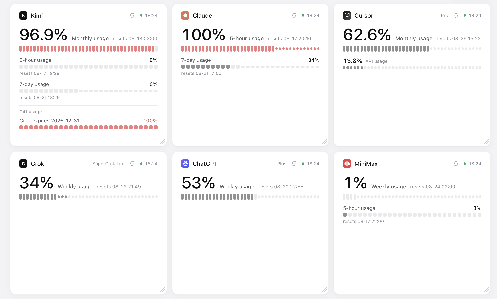

# Usage Dashboard

Self-hostable quota dashboard for Kimi, Claude, Cursor, ChatGPT, Grok, MiniMax, GLM, and Devin. A zero-dependency Node server polls each provider and serves a single-page app plus a macOS [Übersicht](https://tracesof.net/uebersicht/) widget from the same cache.



Cards are **draggable** and **resizable** (12-column grid, saved in `localStorage`). Below 900 px the board drops to a CSS grid. **Reset layout** restores the default arrangement.

## Cards

Each card is titled with the bare provider name. Hero and sub-row labels:

| Provider | Hero | Sub-rows |
|----------|------|----------|
| Kimi | Monthly usage | 5-hour usage, 7-day usage, Gift usage (when the API returns gifts) |
| Claude | 5-hour usage | 7-day usage, Model limits · weekly (when scoped limits exist) |
| Cursor | Monthly usage | API usage |
| ChatGPT | 5-hour usage | Weekly usage |
| Grok | Weekly usage | — |
| MiniMax | 5-hour usage | Weekly usage |
| GLM | 5-hour usage | Weekly usage |
| Devin | Daily usage | Weekly usage |

Pixel rails fill amber at ≥70 % and red at ≥90 %. Percents display to one decimal. A live-dot in the header shows last refresh time, or `refreshing` / `stale` / `error`. The circular button next to it POSTs `/api/refresh/:provider`.

Status meanings:

- **stale** — credential or token rejected (HTTP 401/403, expired JWT, bad file). Last values stay on screen; re-harvest credentials.
- **error** — network, timeout, HTTP 5xx, parse. Last values stay; retry.
- ChatGPT `tokenExpired` and Grok `tokenExpired` also show a red banner pointing at the matching credential file.

A Claude `503` on the dashboard is usually an Anthropic outage, not a bad cookie. Check the browser-side banner before re-harvesting.

## Quick start

Requires **Node.js 18+**. No npm dependencies.

1. Copy templates from [`credentials/`](credentials/) into `~/.quota-watch/` (preferred) or leave filled files in `./credentials/`:

```
~/.quota-watch/kimi.json
~/.quota-watch/claude.json
~/.quota-watch/cursor.json
~/.quota-watch/chatgpt.json
~/.quota-watch/minimax.json
~/.quota-watch/grok.json
~/.quota-watch/glm.json
~/.quota-watch/devin.json
```

`chmod 600` those files. How to obtain or refresh tokens (DevTools or browser automation): [`.cursor/skills/refetch-quota-credentials/SKILL.md`](.cursor/skills/refetch-quota-credentials/SKILL.md).

2. Start the server:

```bash
npm start
```

Open [http://localhost:3847](http://localhost:3847).

The server refreshes every provider on boot and every **15 minutes**, serves `public/`, and exposes:

| Endpoint | Method | Description |
|----------|--------|-------------|
| `/api/status` | GET | Cached provider payloads (`refreshing` + `providers`) |
| `/api/refresh` | POST | Immediate refresh of all providers (202) |
| `/api/refresh/:provider` | POST | Refresh one of `kimi`, `claude`, `cursor`, `chatgpt`, `minimax`, `grok`, `glm`, `devin` |

The dashboard and Übersicht widget poll `/api/status` every 30 s.

Optional env vars:

| Variable | Default | Purpose |
|----------|---------|---------|
| `PORT` | `3847` | HTTP port |
| `QUOTA_WATCH_CRED_DIR` | `~/.quota-watch` if it has real creds, else `./credentials` | Credential directory |
| `QUOTA_WATCH_TZ` | `Europe/Warsaw` | Timestamp timezone |
| `QUOTA_WATCH_INTERVAL_MS` | `900000` | Server-side refresh interval |

```bash
npm test
```

runs the `node --test` suite (`test/*.test.js`).

## Credentials

Never commit real secrets. Only `credentials/*.template` belong in git.

### Kimi (`kimi.json` preferred; `kimi-token.txt` legacy)

```json
{
  "accessToken": "eyJ…",
  "refreshToken": "eyJ…"
}
```

- **accessToken** (~15 min): `localStorage.access_token` on https://www.kimi.com, or `Authorization: Bearer` on a `MembershipService` request
- **refreshToken** (~90 days): `localStorage.refresh_token` — required so the server can rotate access tokens
- Legacy `kimi-token.txt` (access JWT only) works until it expires; without a refresh token the card goes stale after ~15 minutes

### Claude (`claude.json`)

```json
{
  "cookies": "sessionKey=...; otherCookie=...",
  "orgId": "your-org-uuid"
}
```

- `cookies`: copy cookies from a logged-in https://claude.ai request
- `orgId`: from `https://claude.ai/api/organizations/{orgId}/usage`

### Cursor (`cursor.json`)

```json
{
  "cookie": "WorkosCursorSessionToken=..."
}
```

- Session cookie from a logged-in https://cursor.com request (HttpOnly — copy from Network headers)

### ChatGPT (`chatgpt.json`)

```json
{
  "bearer": "eyJhbGci...",
  "deviceId": "uuid-here",
  "sessionCookie": "__Secure-next-auth.session-token=..."
}
```

- `bearer`: JWT from `Authorization`
- `deviceId`: from `oai-device-id`
- `sessionCookie`: optional; full session cookie if needed

On HTTP 401 the card shows a **Token expired** banner.

### MiniMax (`minimax.json`)

```json
{
  "token": "eyJhbGci...",
  "groupId": "your-group-id"
}
```

- `token`: JWT from `_token` cookie on https://platform.minimax.io
- `groupId`: from `x-group-id`

### Grok (`grok.json`)

```json
{
  "sso": "your-sso-cookie-value",
  "plan": "SuperGrok Lite"
}
```

- `sso`: value of the `sso` cookie from a logged-in https://grok.com request
- `plan`: optional display label
- The fetcher calls Grok's private gRPC-Web `GetGrokCreditsConfig` endpoint. Analytics, Stripe, and Cloudflare cookies from DevTools **Copy as cURL** are unused.

### GLM (`glm.json`)

```json
{
  "apiKey": "xxxxxxxxxxxxxxxx.xxxxxxxx"
}
```

- `apiKey`: API key from https://z.ai/manage-apikey — the key the GLM Coding Plan is tied to
- Uses Z.ai's internal quota endpoints (`/api/monitor/usage/quota/limit` for meters, `/api/biz/subscription/list` for the plan label). A `success:false` body saying there is no coding plan surfaces as an error, not stale.

### Devin (`devin.json`)

```json
{
  "token": "auth1_...",
  "orgId": "org-..."
}
```

- `token`: `Authorization: Bearer` from any authenticated https://app.devin.ai request (e.g. the `billing/quota/usage` call the settings/usage page makes)
- `orgId`: the `x-cog-org-id` header on the same request, also visible in the API URL path
- Orgs on weekly-only billing return `hide_daily_quota: true`; the daily meter then renders empty.

## Project layout

```
server.js              # static file server + refresh loop
lib/paths.js           # credential path resolution
lib/time.js            # timezone helpers
lib/errors.js          # StaleError vs generic fetch failures
lib/fetchers/          # provider API clients + shared request helper
public/                # single-page dashboard (app.js, layout.js, styles.css)
credentials/           # templates only (gitignored secrets)
test/                  # node:test suite
docs/                  # screenshot + harvest notes
.cursor/skills/        # agent skill for refetching credentials
ubersicht/             # macOS desktop widget
automations/           # original Python automations (reference)
```

## macOS desktop widget

The same cards render on the desktop via [Übersicht](https://tracesof.net/uebersicht/) — see [`ubersicht/README.md`](ubersicht/README.md). It reads `/api/status`, so the server must be running either way. Card titles and metric labels match the web dashboard.

`automations/` is the original Kimi Canvas migration pack. The runnable app is the Node server + `public/` page.
